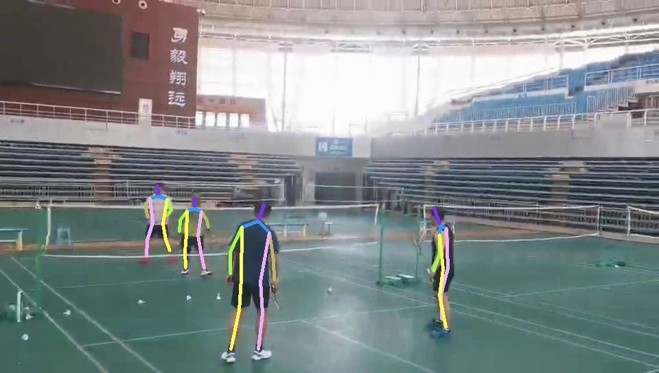
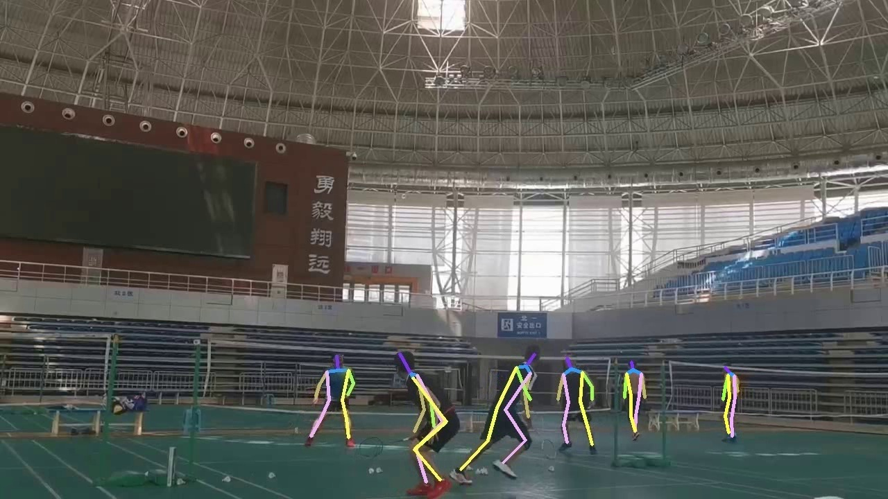

# Badminton Dataset
### This is the official website of the Badminton dataset. 
Badminton is a human pose estimation dataset focusing on various Badminton scenes. We provide the pose annotations following the format of PoseTrack.
 Dataset can be found in this [link](https://drive.google.com/drive/folders/1YJQfSAPPlL0LXkkdnCBX_bmOsbBTtwUU).
 

